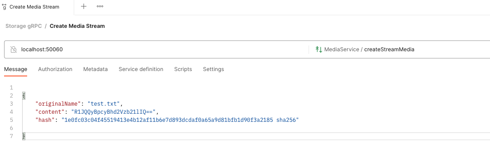

# Media Hub

Media Hub is a Spring Boot application that provides a gRPC service for handling media files, as opposed to a regular HTTP REST API. This allows for a more efficient and performant communication between the client and server, as gRPC uses the protocol buffers binary format for data serialization.

The media files are stored in MongoDB GridFS, a scalable and efficient way to store large files in MongoDB. This storage solution is more efficient than using the regular file system or a relational database, as it allows for easy sharding and indexing of files.

### Features

* gRPC service for handling media files
* MongoDB GridFS for storing and retrieving media files
* Aspect-oriented programming (AOP) for logging
* Spring Data MongoDB for interacting with MongoDB
* Spring Boot for easy application setup and configuration
* Node js command line application to interact with the gRPC server
* Docker environment to run MongoDB instance and eventually, rum the new Media Service

You can run this service either running the app in your machine or using docker to run the Media Service

At the end of this README you will find more details on the implementation

### Steps to execute this Service

#### Media Service 

##### Installation

1. Clone the repository:
```shell
https://github.com/raeffray/mediahub.git
```
2. Navigate to the project directory:
```shell
cd mediahub
```

3. Make sure you have the mongodb service running with this command:
```shell
docker-compose -f media-services-deployment/mediahub-backing-services/docker-compose.yaml up -d mongodb
```

4. Create the required DB Credentials:
```shell
cd media-services-deployment/mediahub-backing-services/
sh ./post-install-update.sh
##  Returning to the project base directory
cd -
```

5. Build the project using Gradle:
```shell
gradle build
```

6. (Optional) Configure the following environment variable:
```shell
# Define the buffer size for Download. E.g: 256000 -> 256kb
APP_MEDIA_BUFFER_SIZE=256000
# Looging level for package jp.mediahub
LOGGING_LEVEL_JP_MEDIAHUB=DEBUG
```

6. Run the application:
```shell
gradle bootRun
```

7. The app should now be running now.


### Node JS Command line 

This is a command-line application that allows you to interact with the gRPC Media Service. The application provides commands for uploading, downloading, listing, and deleting media files on the remote server.

The application is built with Node.js and uses the following libraries:

* `commander` for command-line parsing
* `@grpc/grpc-js` and `@grpc/proto-loader` for communicating with the gRPC service
* `fs` for reading and writing local files
* `cli-progress` for displaying progress bars
* `path` and `hasha` for working with file paths and hashes.

#### Media Service Endpoint

A environment variable `MEDIA_SERVICE_ENDPOINT` might be set, having `localhost:50060` as fallback

#### Installation

To use this application, you need to have Node.js and npm installed on your machine. Once you have Node.js and npm set up, you can install the application by running the following command:

```shell
npm install
```

and finally 

```shell
npm run build
```
This last command will generate a executable file in `dist` folder for the following Linux, Mac and Windows

#### Usage

The application provides the following commands:

* -l, --list: Lists all files from the server. The response will be a json containing the media information.
* -u, --upload <file-path>: Uploads a media to the remote server.
* -d, --download <file-name>: Downloads a media from the server.
* -r, --remove <file-name>: Deletes a media from the server.

Examples:

This examples are considering use inside dist, but naturally you can move it to anywhere else and just execute the binary for your OS.  

Uploading
```shell
./dist/media-cli-macos -u test.txt
/Users/raeffray
progress [████████████████████████████████████████] 100%
Upload finished ! Server response: {"success":true}
```

Listing
```json
{
  medias: [
    {
      originalName: 'test.txt',
      size: [Long],
      hash: '1e0fc03c04f45519413e4b12af11b6e7d893dcdaf0a65a9d81bfb1d90f3a2185 sha256'
    }
  ]
}
```
Downloading
```shell
./dist/media-cli-macos -d test.txt
progress [████████████████████████████████████████] 100%
Download finished !
```

Removing
```shell
./dist/media-cli-macos -r test.txt

{ success: true }
```


#### Verifying the media integrity

Uploading a media utilizing `media-cli` will upload a file sending a hash code utilizing sha-256 algorithm.

Once you download  the media, you can verify the media integrity run the following command:

````shell
shasum -a 256 ./test.tex
````

The hash must the same saved in the Database.


### Uploading a file using Postman

Postman has added gRPC support so that you can create a media using this tool:

1. Create your collection
2. Create a new gRPC request
3. Enter `localhost:50060` to server URL
4. Select `MediaService/CreateStreamMedia`
5. Add the following Json as message
```json

{
"originalName": "test.txt",
"content": "R1JQQyBpcyBhd2Vzb21lIQ==",
"hash": "1e0fc03c04f45519413e4b12af11b6e7d893dcdaf0a65a9d81bfb1d90f3a2185 sha256"

}
```
6. Click on `Invoke` and on the bottom section click on `Send`and then on `End Streaming`
7. Create another gRPC request, but this time go for `MediaService/ListMedias`
8. Click on invoke
9. You are supposed to see
```json
{
    "medias": [
        {
            "originalName": "test.txt",
            "size": "16",
            "hash": "1e0fc03c04f45519413e4b12af11b6e7d893dcdaf0a65a9d81bfb1d90f3a2185 sha256"
        }
    ]
}
```
Example of postman gRPC request:



### Deployment in Docker environment

You can deploy the Media Service in a Docker container by following these steps:


### Database setup

#### Creating the database:

Please execute:

```shell
docker-compose -f media-services-deployment/mediahub-backing-services up -d mongodb
```

#### Creating credentials:

Please execute:

```shell
media-services-deployment/mediahub-backing-services/>sh ./post-install-update.sh
```

### Media Service setup (Optional)

#### Creating the Image

In order to create the Media Service image, please execute:

```shell
cd mediahub/
sh ./create-docker-image.sh
```

To start up the media container go to your project root and execute please execute:

```shell
docker-compose -f media-services-deployment/mediahub-backing-services/docker-compose.yaml up  media-service
```

### Monitoring

The Media Service can be monitored by JMX (Java Management Extensions)

The docker-compose file take care of parameters required. Running locally one might need to add it to its debug/run configuration

This an example of this app utilizng 65kb as chukc size to upload and download a large (520mb) file

The heap utilization has to be adjusted to each context. 


## Details on the implementation

### Media Service

#### Chosen Solution

gRPC is a high-performance, open-source framework for building remote procedure call (RPC) APIs. It uses Protocol Buffers, a binary serialization format, to efficiently encode and decode data. I judged that it would make it an ideal choice for building a media service over HTTP for several reasons:

1. Performance: gRPC uses a binary protocol, which is faster and more efficient than the text-based HTTP protocol. This can result in significant performance improvements when sending and receiving large amounts of data, such as media files.
2. Streaming: gRPC real streaming, which allows large media files to be uploaded or downloaded in chunks. This can be useful for situations where the client or server has limited memory or bandwidth. This can be partially true in HTTP or restful service, but for each chunk will require new request, putting in place all the boilerplate required, whereas in gRPC a channel is established, making the communication more efficient and easier to manage, making it possible to be canceled, for example.
3. Compatibility: gRPC is language-agnostic, which means that it can be used to build services and clients in a variety of programming languages. This can make it easier to work with a media service that is built on gRPC, as it can be integrated into a variety of different applications. I n this case a node client was created, but any other language that has grpc library available, such as GoLang could be used.
4. Authentication and Authorization: Although I am not using in this exercise, gRPC supports various authentication and authorization mechanisms, this allows to secure the communication in a more granular way. This can be useful for situations where the media service needs to be securely accessed by multiple clients.
5. Data validation: gRPC allows to use Protocol Buffers to define the structure of data, this allows to validate the data in the client and server side, avoiding several errors that could come from the client.

Overall, gRPC is a good choice for building a media service as it offers high performance, efficient data transfer, and support for streaming and secure communication, making it well suited for large data transfers and real-time streaming use cases.

#### Media Storage

MongoDB's GridFS is a way to store and retrieve large files, such as images, audio and video files, and documents, in MongoDB. It works by breaking the large files into smaller chunks, and then storing each chunk as a separate document in a MongoDB collection.

When a large file needs to be stored in MongoDB, GridFS splits it into chunks of a predefined size (usually 256KB or smaller). Each chunk is then stored as a separate document in a MongoDB collection, with metadata about the file also stored in a separate collection.

This information will be placed in `db.fs.files` data structure and each will have one or more `db.fs.chunks`

* Alternatively a cloud provider, such Amazon Web Services, Microsoft Azure or Google Cloud Platform can be used. To do so, we would need to write a MediaContainer Implementation for each one.

#### implementation

The Media Service was built in Java language and utilize gradle 0as build automation
The project was set up as multimodule, but runs with just one.

##### Structure

`ext/proto` contains:

  1. [media-messages.proto](ext%2Fproto%2Fmedia-messages.proto) File describing the messages utilized in Media Services
  2. [media-services.proto](ext%2Fproto%2Fmedia-services.proto) File describing Media Services

`media-services-deployment/mediahub-backing-services` contains docker-compose to create:
  1. mongo db utlized in this solution
  2. medias-service, optional way to run this service.
 
`node/media-cli` Node client to communicate with this service

`mediahub-service` this Medias service Java structure, where:
 1. `src/main/java/jp/mediahub/media/configuration` holds the configuration required for this application:
    1. `GridFsConfiguration.java` Configuration for MondoDB Grid FS
    2. `MediaContainerConfiguration.java` Configuration for the MediaContainer
 2. `src/main/java/jp/mediahub/media/timing` and `src/main/java/jp/mediahub/media/timing/annotation` annotation and its aspect class to marks execution time for methods annotated with it, utilizing StopWatch.
 3. `src/main/java/jp/mediahub/media/repository`, interface and implementation
    1. `MediaRepository.java` The Repository class, containing delete, find and find all operations
    2. `DefaultMediaRepository.java` Implementation of `MediaRepository.java`
 4. `src/main/java/jp/mediahub/media/server`
    1. `MediaHubServer.java` bootstrap for this app
 5. `src/main/java/jp/mediahub/media/service'
    1. `GRPCMediaServiceAPI.java` Implementation os MediaService described in its protobuf file
 6. `src/main/java/jp/mediahub/media/stream`
    1. `MediaDownloadStreaming.java` Manages the streaming from MediaContainer, sending the grpc observer
    2. `MediaUploadStreaming` Oserver that receives the streaming from the client and stream it to the MediaContainer  
 7. `src/main/java/jp/mediahub/media/stream`
    1. `MediaContainer.java` Abstraction that holds Download and Upload stream. In MongoDB is close to Bucket concept.
    2. `DownloadStream.java` Abstraction that holds an inputStream and the media size
    3. `MongoDbMediaContainer` Mongodb implementation of MediaContainer
 8. `resources`
    1. `application.yaml` App configuration
    2. `application-docker.yaml` App configuration for Docker environment, changing just the mongodb hostname to utilize the alias create in the docker-compose.yaml

### Node Command Line

##### Structure

1. `src`
   1. `index.js` Entry point for the command line. Defines commander program with the options. It will call the functions described in the following `executor.js`
   2. `executor.js` Facade to bridge `index.js` and and `MediaService.js`
   3. `MediaServiceImpl.js` class that communicates with Media Service endpoint, utilizing grpc libraries. It will provide the same functionalities os media serviice gRPC service.
It will control upload and download streaming. 
      1. When uploading it will generate a hash sha-256 of the original file aand create a readable Stream, based on a pre-defined buffer size and stream it to the gRPC service.
      2. When Downloading it will establish a stream with the gRPC server and create a writable stream to save the file.  
2. `package.json` it will define some extra scripts such as:
   1. `copy-proto` copy the proto definition to the node structure
   2. `build` execute `copy-proto` and build the app utilizing `pkg` to generate the binaries into `dis` folder

# mediahub
